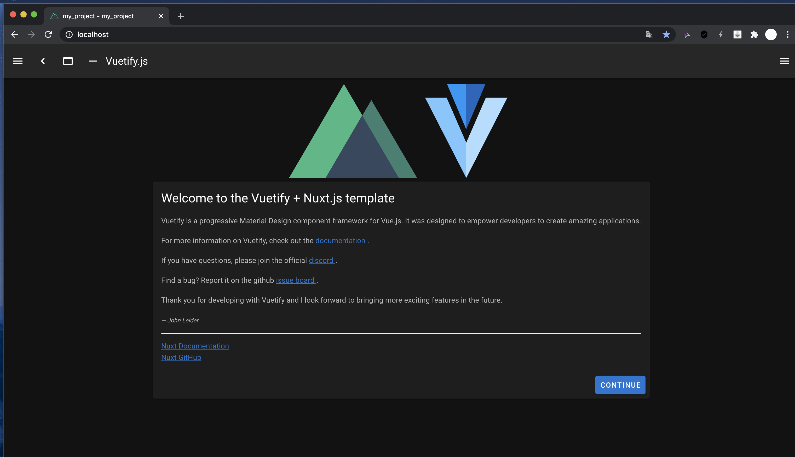

# docker-nuxtjs

# 概要

* nuxt.jsのセットアップ、新規プロジェクト作成、サーバー起動までをかんたん手順で行えます。
* Dockerコンテナとして構築するので、お手元のPCを汚しません。
* 複製、破棄、構築しなおしも手軽に行えます。

# 必要なもの

* Docker
* docker-compose
* makeコマンド

がインストールされている Mac / Linux。

# 使い方

## このリポジトリをcloneまたはダウンロード＆解凍する。

## 以下の２つのファイルを編集する。

### .env

PROJECT_NAMEの値をご自分の希望に合わせて編集してください。<br />
この値は、nuxt.jsプロジェクトのディレクトリ名にもなります。

```.dotenv
PROJECT_NAME=my_project
```

### Makefile

最近のバージョンでは、nuxt.jsプロジェクト作成コマンド実行時、途中でカスタム内容の指定を求められます。<br />
本一式ではその入力を自動化するために create-nuxt-app実行時のオプション --answers で予めカスタム内容を指定するようにしています。<br />
<br />
カスタム項目一覧はこちらの公式ソースコードからご確認いただけます。→ [nuxt.js公式リポジトリ内、prompts.js](https://github.com/nuxt/create-nuxt-app/blob/master/packages/create-nuxt-app/lib/prompts.js) <br />
--answers のパラメータをJSON形式で指定して、ご自分のご希望に合わせて下さい。
<br /><br />
`Makefile>docker-compose>bash -c と入れ子になっているためエスケープが若干複雑ですみません。基本的にベースサンプルをコピペ＆編集して頂ければ大丈夫かとは思います。`

```makefile
...
...
create-nuxt-app:
	docker-compose exec dev bash -c 'create-nuxt-app $$PROJECT_NAME --answers "{ \
	\"name\": \"$$PROJECT_NAME\", \
	\"language\": \"js\", \
	\"pm\": \"yarn\", \
	\"ui\": \"vuetify\", \
	\"features\": [\"axios\"], \
	\"linter\": [\"eslint\"], \
	\"test\"  : \"jest\", \
	\"mode\"  : \"universal\", \
	\"target\"  : \"static\", \
	\"devTools\": [\"jsconfig.json\"] }" \
	'
...
...
```

## コマンドインターフェースを起動する。

## ダウンロードしたフォルダの中に移動する。

```shell script
# git cloneした場合
cd docker-nuxtjs

# ZIPをダウンロードして解凍した場合
cd docker-nuxtjs-master
```

## 以下のコマンドを実行する。

```shell script
make init
```

成功すると、このような表示になります。↓

```shell script
...
...
yarn run v1.22.4
$ eslint --ext .js,.vue --ignore-path .gitignore . --fix
Done in 24.57s.

🎉  Successfully created project my_project

  To get started:

	cd my_project
	yarn dev

  To build & start for production:

	cd my_project
	yarn build
	yarn start

  To test:

	cd my_project
	yarn test

docker-compose exec dev bash -c 'sed -i -e "s@export default {@export default {\n  telemetry: false,\n@g" $PROJECT_NAME/nuxt.config.js'
docker-compose exec -d dev bash -c 'cd $PROJECT_NAME && npm run dev'

$
```

## Nuxt.jsサンプルページが起動しているはずなのでアクセスしてみる。

* http://localhost



↑ こんなページ、見れましたでしょうか？<br />
見れたら成功です。

本リポジトリ内の`app/`とdockerコンテナ内の`/work/app`が同期（ボリュームマウント）しているので、例えば

```
app/$PROJECT_NAME/pages/index.vue
```

を編集すれば、即座に↑のサンプルページに反映されます。

## Dockerコンテナを停止する

```shell script
make stop
```

## Dockerコンテナを起動する

```shell script
make up
```

## Dockerコンテナを再ビルドする

```shell script
make remake
```

※ Nuxt.jsプロジェクトの再作成はしません。Dockerコンテナとしての再ビルドです。

## 本一式を完全廃棄する

```shell script
make destroy
```

※ このコマンドだけではapp/や本一式の内容物をいきなり削除はしないのでご安心ください。

そのあと、ご自身の手で本一式のディレクトリを削除してください。